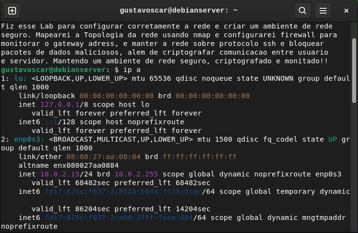
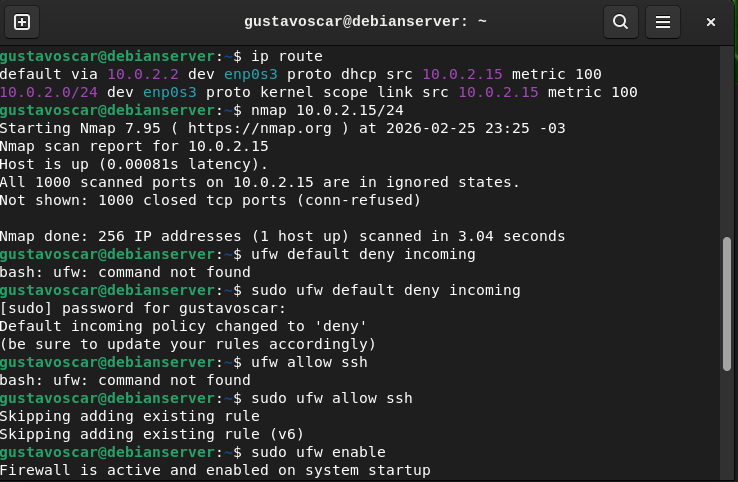
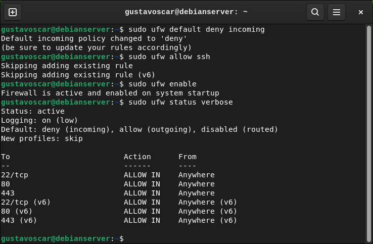

# linux-network-security-lab
In this repository, i configure the network firewall rules to control acess to the gateway, enhancing the security of the network.

Lab de Redes {Configuração de Rede, Mapeamento de Rede e Configuração de Firewall}

Começei o lab me situando na rede no terminal, verificando ipv4 e ipv6 e a sucessividade da conexão da rede.

Após estar situado na rede, usei ip route pra saber qual é o meu endereço gateway padrão. Tendo esse discernimento, usei a ferramenta
NMAP para mapear a topologia da rede, verificando seu tráfego interno e seus hosts ativos na rede.

Com a rede já estavel, situada, conectada e mapeada, parto para a configuração do firewall do servidor e da rede, primeiro eu uso o comando
"Sudo ufw default deny incoming" para que o firewall bloqueie qualquer envelope de dados vindo de fora da rede, permitindo apenas que
pacote saiam da rede, deixando a entrada bloqueada. Após esse comando, eu uso o "Sudo ufw allow ssh" pra permitir o protocolo SSH
de rede, que é um protocolo de gerenciamento de servidores e criptografia entre usuário e servidor, deixando o ambiente de rede mais seguro.
Após esse comando, eu uso "Sudo ufw enable" para ativar o firewall e suas configurações recém-executadas. Com o firewall já ativo dentro da rede, eu uso o comando "Sudo ufw status verbose" para acompanhar as portas da rede e verificar suas devidas permissões.
Firewall devidamente configurado, a rede está segura como mostra o terminal, por padrão, na configuração do firewall, o endereço gateway
está devidamente monitorado, as permissões de acesso a rede estão bloqueadas e o ambiente de rede está seguro, Acompanhe o terminal.

Este foi o meu Lab prático dentro de uma VM para a configuração de firewall e monitoramento do endereço gateway, ponto crítico em invasões cibernéticas.

